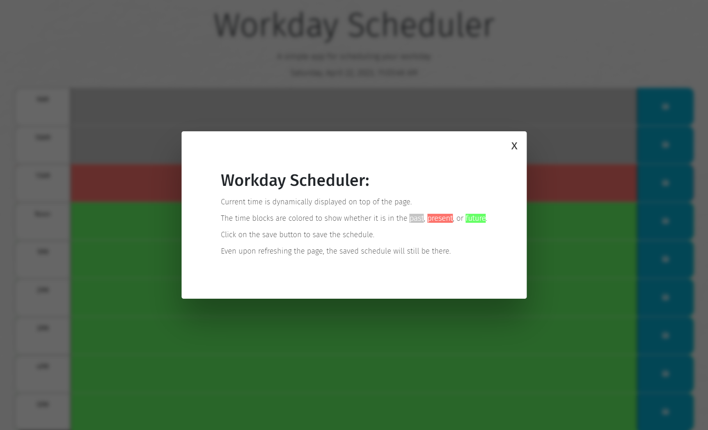

# Workday Scheduler

This is a simple scheduler application that allows a user to save events for each hour of the day. This app will run in the browser and feature dynamically updated HTML and CSS powered by JavaScript and jQuery.

## Description

 It uses the day.js library to work with date and time. The application displays standard business hours (9 a.m. to 5 p.m.). Each time block represents one hour and contains the following:

* The time
* A field to hold user input
* A save button

 Save button will store the time and user input in local storage. When the user refreshes the page, the saved events will still be there.

 Modal will pop up only on the first load of the application. You can close the modal by clicking the close button or by clicking outside of the modal. You can also close it by pressing down the ESC key.

## Getting Started

You can simply click on the link to the deployed application: https://jyoungjoon.github.io/workday-scheduler/

### Dependencies

It is recommended to use Google Chrome to run this application.

### Installing

No installation required. However, you can clone the repository to your local machine and open index.html in your browser.

### Executing program

* Simply click on the link to the deployed application: https://jyoungjoon.github.io/workday-scheduler/

## Help

If you have any questions, please contact me at [@lif3scriptified](https://twitter.com/lif3scriptified)

## Authors

Young Jang [@jyoungjoon](https://github.com/jyoungjoon)

Starter code provided by UC Berkeley Extension Coding Bootcamp.

## Version History

* 0.3
    * Added README and LICENSE

* 0.2
    * Added modal and script

* 0.1
    * Initial Release

## License

This project is licensed under the [MIT] License - see the LICENSE.md file for details

## Acknowledgments

Background Image by [Freepik](https://www.freepik.com)

Inspiration, code snippets, etc.
* [awesome-readme](https://github.com/matiassingers/awesome-readme)
* [PurpleBooth](https://gist.github.com/PurpleBooth/109311bb0361f32d87a2)
* [dbader](https://github.com/dbader/readme-template)
* [zenorocha](https://gist.github.com/zenorocha/4526327)
* [fvcproductions](https://gist.github.com/fvcproductions/1bfc2d4aecb01a834b46)
